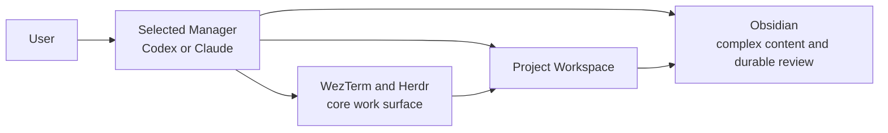

# Derivation Engine User Guide

[Switch to 中文](zh-CN.md) · [English]

Status: this guide separates current capabilities from next-stage targets. Commands and directories marked as next-stage targets are not executable yet.

## 1. What this system is

Derivation Engine uses a `Project Workspace` as its top level. A user creates a Project first, then adds Notation, Hypotheses, and Theorem Derivation as needed.



Users do not need to remember the internal Python commands. When starting a Project, the user selects Codex or Claude as the `Manager Host`; the current profile defaults to Codex. The selected Manager owns startup and ongoing management, Herdr is the core live-work surface, and Obsidian presents complex, structured, durable content. Both Managers share one Project Workspace and Framework Runtime rather than creating two systems.

## 2. Responsibilities of the user, Manager, and work surfaces

### User

The user owns the research intent and consequential decisions: the Project goal, whether to reuse a related Project, the meaning of Notation, the Hypothesis definition, and acceptance of Review results.

### Selected Manager

The user may select the Codex Manager plugin or Claude Manager plugin. Both satisfy the same Manager interface: inspect existing Projects, establish or recover the workspace, open or focus Obsidian and WezTerm/Herdr, and remain responsible for source registration, state recovery, module preparation, task scheduling, and next-step management. A Project has exactly one `Active Manager` at a time; switching requires a durable Handoff and never permits concurrent state mutation by both Managers.

The two Manager plugins and the shared Manager interface are the approved next-stage design, not current behavior. Today one Agent performs the Manager role by invoking the module commands directly, and `.de/project.json` records neither the Manager selection nor Handoff state.

### Obsidian

Obsidian is the complex-content and durable-review window. It displays the Project, Sources, Background, Notation, Hypotheses, derivation paths, Evidence, Counterexamples, and Commit Decisions. When content is long or requires graph structure, Mermaid, Graph view, comparison, or formal Review, the Agent projects it into Obsidian.

### WezTerm and Herdr

WezTerm hosts the Herdr workspace. Herdr is the core work surface in the current Reference Profile: Dialogue handles live work conversations scheduled by the Active Manager, and Worker handles bounded execution. Herdr does not independently acquire Project management authority. Terminal scrollback is not authoritative state; complex results must be written to Obsidian or a durable Project artifact, after which the Active Manager recovers the next action. The implemented Herdr runtime is created per Hypothesis; a Project-level Herdr workspace is a next-stage target.

## 3. Shortest way to use it

A user starts and continues to manage the Project in the selected Manager, enters Herdr for live work, and enters Obsidian for complex review:

| Goal | Interaction surface | Example user request |
| --- | --- | --- |
| Create an empty Project | Selected Manager | “Start a new Derivation Engine Project titled ...” |
| Start from LaTeX | Selected Manager | “Start a Derivation Engine Project from `/path/paper.tex`.” |
| Add material | Selected Manager | “Add `/path/notes.pdf` to this Project.” |
| Inspect status | Selected Manager | “Check what this Project is missing.” |
| Establish Notation | Selected Manager | “Organize Notation from the current material.” |
| Review complex Notation | Obsidian | Open the Notation Registry or Review link provided by the Agent. |
| Propose a Hypothesis | Selected Manager | “Propose a Hypothesis inside this Project.” |
| Recover a Hypothesis | Selected Manager | “Manage HY-NNN.” |
| Start derivation | Selected Manager | “Create a theorem derivation case from HY-NNN.” |
| Enter live work | WezTerm + Herdr | Clarify the task in Dialogue or supervise Worker execution. |
| Inspect derivation paths and evidence | Obsidian | Open the Derivation View provided by the Agent. |

The Active Manager should report findings and blockers first, then ask the user only for decisions that genuinely require human authority.

## 4. Starting a Project

### 4.1 Empty Project

The user does not need to create a directory manually. In the Codex or Claude Manager, say “Create a new Project under this directory,” supply a title, and optionally state an initial problem. If no default is saved, the Manager first asks whether this Project uses Codex or Claude; the current Reference Profile defaults to Codex. It then:

1. Inspects the target catalog for existing Project Workspaces.
2. Discusses reuse, extension, or separation if a plausibly related Project exists.
3. Selects or confirms a `PRJ-NNN` identifier.
4. Creates the Project scaffold without silently creating Notation or a Hypothesis.
5. Creates or recovers a Project-level Herdr workspace.
6. Opens or focuses the Project's Obsidian vault and WezTerm/Herdr.
7. Reports Background and next-module readiness in the selected Manager.

Steps 5–7 describe the next-stage bootstrap target. The current implementation creates the Project scaffold but does not yet launch both working windows or create Project-level Herdr automatically.

An empty Project may remain incomplete. It is a managed research container, not a claim that the research question has already been settled.

### 4.2 Project from LaTeX or an article

The file may remain in Downloads or any user directory. The user gives the selected Manager its exact path. The Manager copies it into the Project `Sources/`, records its source name and SHA-256 digest, and does not modify the original.

```text
PRJ-NNN/
└── Sources/
    ├── SRC-001-paper.tex
    ├── SRC-002-article.pdf
    └── README.md
```

Adding a file means only that the material was registered. It does not mean the paper's contents, Notation, or conclusions were accepted.

## 5. Adding material and the Loading Dock

### Current capability

The user gives the selected Manager a file path or webpage and asks it to add the material to the current Project. The Manager invokes `add-source`; local files are copied, while a webpage is recorded as provenance only. The Agent must retrieve and analyze webpage content separately.

Merely placing an arbitrary file in `Sources/` does not start a workflow; there is no watcher today. A manually placed file is also not added automatically to `.de/project.json`.

The Notation V1 Loading Dock is implemented, but it belongs to a separate Notation V1 workspace: scanning is explicit, and no Project Workspace command attaches that workspace to `.de/project.json`. A Project therefore has no Loading Dock of its own today. A user can say:

> Send this material to the Notation V1 Loading Dock used for PRJ-NNN and check whether it can form a formal semantic record.

The Active Manager selects or creates that separate Notation V1 workspace, keeps the note of which workspace serves PRJ-NNN outside the Project manifest, then performs classification, proposal, review, and admission. If the material type is unclear, the Loading Dock places it in `needs-user`, and the Manager asks one concrete question.

### Next-stage target

The planned flow is:

```text
Sources/Inbox
  -> registration and deduplication
  -> Project ownership check
  -> Sources/Library
  -> optional Project-local Loading Dock
```

The target interaction is: the user drops files into `Sources/Inbox/` and says only “Load the new material” in the selected Manager. This flow is not implemented yet.

## 6. Establishing Notation

Notation is normally the first module after Sources and Background. A user does not need to prepare a JSON manifest and can tell the Active Manager:

> Organize Notation from the current Sources. List symbols, meanings, and conflicts first; do not resolve ambiguity silently.

The Active Manager should:

1. Propose candidate symbols and their physical or mathematical meanings.
2. Expose overloaded symbols, multiple symbols for one concept, and scope conflicts.
3. Ask the user to resolve ambiguities that affect Project semantics.
4. Generate and check the Notation V2 Registry.
5. Attach Notation to the Project and provide its Obsidian entrypoint.

Use Notation V1 and the Loading Dock when material requires formal semantic admission, snapshots, or invalidation checks. V1 and V2 are currently independent modules.

## 7. Creating and managing a Hypothesis

A Hypothesis is a fluid second-layer work unit, not the Project itself. Before creation, the Active Manager checks:

- problem statement;
- scope;
- background summary;
- related-Project decision;
- source basis.

When Background is incomplete, the Agent should report blockers and must not attach a Hypothesis to the Project. A formal mathematical Hypothesis should normally have Notation first; missing Notation is currently a warning, not a universal prohibition on every Hypothesis.

After the user confirms a title and falsifiable working statement, the Agent creates `HY-NNN`. Later, saying “Manage HY-NNN” in the selected Manager recovers the same work unit, Handoff, Review, and Worker runtime.

## 8. Theorem Derivation and verification

The user can ask the Active Manager to create a derivation case from an existing Hypothesis. The system separates:

- A records and the B theorem graph: committed static state;
- the C attempt ledger: dynamic proposals and failed attempts;
- verifier evidence: scoped results from SMT, finite-domain checks, or another adapter;
- the commit automaton: the only interface that advances a checkpoint.

An outcome is `advanced`, `refused`, `unsupported`, or `indeterminate`. Only `advanced` produces a new checkpoint. A Counterexample must be decoded and replayed; an unavailable solver cannot be reported as having verified anything.

## 9. When to switch windows

```text
Selected Manager: Codex or Claude
  -> create/recover the Project
  -> ongoing management and scheduling after startup
  -> launch or focus both working windows (next-stage target)
WezTerm + Herdr                         Obsidian
  -> live work dialogue                 -> complex content
  -> Agent/Worker execution             -> graphs, paths, and Evidence
  -> return durable results             -> durable Review and Handoff
          \                               /
           -> shared durable Project state <-
```

The Active Manager handles startup and all post-startup management. Herdr is the core live-work surface. Obsidian handles complex presentation. The user enters Herdr or focuses an Obsidian page from the selected Manager, then returns to that same Manager after the work or Review to manage the next action.

Launching or focusing both working windows automatically belongs to the next stage; today the Active Manager reports the Project and the user opens the window it names.

## 10. Current Project layout

```text
PRJ-NNN/
├── .de/
│   └── project.json
├── Project.md
├── Background.md
├── Sources/
│   └── README.md
├── Modules/
│   ├── README.md
│   └── Notation/
├── Hypotheses/
│   └── HY-NNN/
└── Theorem Derivation Views/
```

Creating a Project writes `.de/project.json`, `Project.md`, `Background.md`, `Sources/README.md`, and `Modules/README.md`. `Modules/Notation/`, `Hypotheses/HY-NNN/`, and `Theorem Derivation Views/` are conditional outputs: they appear only after Notation is attached, a Hypothesis package is attached, or theorem-derivation views are generated into the vault.

`.de/project.json` is the machine authority for the Project Workspace. `Project.md`, `Background.md`, and `Sources/README.md` are Obsidian projections. Hypothesis Markdown remains human-owned.

## 11. Current limitations

The following capabilities are not complete:

- watching `Sources/Inbox` and starting intake automatically;
- automatically understanding LaTeX or PDF and generating correct Notation;
- deciding automatically whether two Projects are semantically identical;
- a formal Project Workspace attachment to the Loading Dock;
- a checked attachment from theorem cases to the Project manifest;
- a shared identifier adapter across Notation V1, V2, and theorem records.

The Agent can assist with the interpretive work, but it must not present a human procedure as an implemented deterministic guarantee.

## 12. Current local deployment

The repository now contains an npm package around the five internal Python packages. npm is the installation surface. Its postinstall step reuses an available `uv`, or downloads a versioned, checksum-pinned `uv` fallback, then creates an isolated Python 3.11 Runtime inside the installed npm package and installs all five Modules there. The Runtime and the `uv` cache do not modify the system Python environment or shell profile.

The packed artifact is implemented and tested on the current macOS `Reference Profile`. After a maintainer builds or publishes that artifact, installing it is one npm command. The intended public command is:

```bash
npm install -g derivation-engine
```

The package has not been published to the npm registry yet, so that exact registry command is not currently available. A locally packed `.tgz` can already be installed with the same one-command npm flow. The installed compatibility dispatcher is for the Active Manager and maintenance checks; ordinary Project interaction remains natural-language dialogue in Codex or Claude.

The installer reports whether Obsidian, WezTerm, Herdr, Codex, and Claude are available, but it does not install or reconfigure them. Project creation also does not yet launch Obsidian and Project-level Herdr together: the implemented Herdr runtime is created per Hypothesis. Other terminals, workspace managers, knowledge views, Manager plugins, and automatic window launch remain later compatibility work.

## 13. Next stage: Agent-native deployment

The npm Framework Runtime described in Section 12 is implemented. This section describes the Agent-native layer that remains: the two Manager plugins, Herdr Dialogue skill, Local MCP adapter, automatic two-window startup, and Agent tool interface are not implemented yet.

Verdict: when starting a Project, the user selects Codex or Claude as the Manager Host. Both Manager Adapters share the same Framework Runtime, Project Workspace, Herdr, and Obsidian, and each Project has exactly one Active Manager. There is no user-facing `de` CLI.

### Target user interaction

```text
User says in Codex or Claude: “Start a Derivation Engine Project.”
  -> select a Manager Host when no default exists; current default is Codex
  -> Manager Adapter creates or recovers the Project Workspace
  -> automatically opens/focuses Obsidian
  -> automatically opens/focuses WezTerm + Project-level Herdr
User drops files into Sources/Inbox
  -> User says in the Active Manager: “Load the new material.”
Active Manager
  -> registers, deduplicates, and checks Project ownership and Background
  -> prepares Notation, a Hypothesis, or Derivation when requested
  -> schedules Herdr when live work is required
  -> focuses Obsidian when complex presentation is required
```

The selected Agent remains the Active Manager after bootstrap. Except for decisions that genuinely require human authority, it initiates every Project-management action; Herdr performs only scheduled live work. Switching Managers requires an explicit durable handoff and never allows Codex and Claude to write Project state concurrently.

### Recommended installation unit: shared Runtime and two Manager plugins

```text
derivation-engine runtime
├── Manager interface
│   ├── Codex Manager plugin
│   └── Claude Manager plugin
├── Herdr Dialogue skill
│   └── scheduled live terminal dialogue and execution rules
├── Local MCP adapter
│   └── deterministic tools shared by both Manager Adapters and Herdr roles
├── Python runtime
│   ├── project
│   ├── intake
│   ├── notation
│   ├── hypothesis
│   └── theorem
└── templates
```

Install the implemented npm Framework Runtime once on the local machine. The next-stage Codex and Claude plugins use their own platform-native formats, but both must remain thin Adapters of the same Manager interface and must not copy or fork Project logic. A user may install one or both Manager plugins and select one Active Manager for each Project. Each Project stores only research state, the Manager selection, and Handoff state; it does not copy the runtime.

### Planned Agent tool interface

```text
project_start   -> create/recover with a selected Manager and launch/focus both work surfaces
source_intake   -> load material the user placed in Inbox
project_status  -> return readiness, blockers, and the next recommendation
module_prepare  -> prepare Notation, a Hypothesis, or Derivation
work_dispatch   -> schedule bounded live work in Herdr and recover a durable result
manager_handoff -> explicitly switch Codex/Claude Manager after a checkpoint
view_focus      -> focus an Obsidian page or Herdr workspace
```

These are Agent tool interfaces, not user commands, and they are not implemented yet. Tools return structured results; the Agent explains them, asks questions, and decides the next invocation.

### Roles of the Manager plugins and Herdr skill

The Codex Manager plugin and Claude Manager plugin must execute the same Project startup, ongoing-management, and window-scheduling protocol. The Herdr Dialogue skill defines scheduled live work. The current Active Manager receives all management-oriented natural-language triggers:

- “Create a new Project.”
- “Create a Project from this LaTeX file.”
- “Load the new material.”
- “Manage HY-NNN.”

The shared protocol requires the Agent to inspect existing Projects first, create or recover both work surfaces at startup, check Background before creating a Hypothesis, avoid silently resolving Notation ambiguity, allow exactly one Active Manager per Project, send live work to Herdr, and write complex results and formal Review to Obsidian.

### Why the internal runtime may still be packaged

The implemented npm package fixes the Runtime version, Python dependencies, and five internal Module entrypoints. It is an installation boundary, not the user interaction surface. The local MCP adapter can later load this same Runtime without duplicating it. Development and compatibility CLIs remain internal to the Active Manager and maintenance flow.

### Recommended implementation order

1. Implement `Sources/Inbox -> intake` to close the Project bootstrap loop.
2. Implement `project_start` to create or recover a Project and automatically launch or focus both working windows.
3. Refactor the existing command implementations into stable importable Python interfaces.
4. Implement startup and preflight for the current macOS + WezTerm + Herdr + Obsidian Reference Profile.
5. Add a local MCP adapter shared by both Manager Adapters and Herdr roles, keeping its tool interface small.
6. Implement `work_dispatch`, durable Handoff, and exclusive `manager_handoff`.
7. Build separate Codex and Claude Manager plugins and run the same conformance tests against their shared Manager interface.
8. Test both Managers from an empty directory: startup and ongoing management, Herdr live work, Obsidian presentation, Project recovery, and Manager switching.
9. Add other terminal or view installation profiles later; do not introduce an unverified generic terminal interface now.
10. Retain existing CLIs only as development and compatibility entrypoints; ordinary users never need them.

## 14. User quick reference

For daily use, remember only:

1. Select Codex or Claude as the Manager; the current default is Codex.
2. The Active Manager automatically opens or focuses Obsidian and WezTerm/Herdr.
3. Continue to manage the Project and its next actions in the same Active Manager.
4. Use Herdr as the core live-work surface.
5. Read complex content and complete Reviews in Obsidian.
6. Create a durable Handoff before switching Managers; concurrent management is forbidden.
7. Preserve human confirmation for semantic decisions.

[Switch to 中文](zh-CN.md) · [Back to language selection](README.md)
