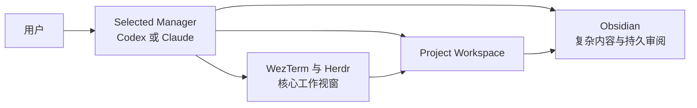

# Derivation Engine 用户手册

[中文] · [Switch to English](en.md)

状态：本手册区分“当前可用”与“下一阶段目标”。标记为下一阶段的命令和目录尚不能执行。

## 1. 这套系统是什么

Derivation Engine 以 `Project Workspace` 为顶层。用户先建立 Project，再按需要添加 Notation、Hypothesis 和 Theorem Derivation。



用户不需要记住内部 Python 命令。启动 Project 时，用户选择 Codex 或 Claude 作为 `Manager Host`，默认使用当前配置中的 Codex。所选 Manager 负责启动和持续管理；Herdr 是最核心的实时工作视窗；Obsidian 呈现复杂、结构化和持久的内容。两个 Manager 共享同一个 Project Workspace 和 Framework Runtime，不形成两套系统。

## 2. 用户、Manager 和工作视窗的职责

### 用户

用户负责研究意图和高影响决定：项目目标、是否复用类似项目、Notation 的含义、Hypothesis 定义，以及是否接受 Review 结果。

### Selected Manager

用户可以选择 Codex Manager plugin 或 Claude Manager plugin。两者满足同一个 Manager interface：检查已有 Project，建立或恢复 workspace，启动或聚焦 Obsidian 与 WezTerm/Herdr，并继续负责材料登记、状态恢复、模块准备、任务调度和下一步管理。每个 Project 同时只能有一个 `Active Manager`；切换必须先形成持久 Handoff，不能让两个 Manager 并发修改状态。

两个 Manager plugin 与共享的 Manager interface 是已确认的下一阶段设计，不是当前行为。当前由一个 Agent 直接调用模块命令承担 Manager 角色，`.de/project.json` 既不记录 Manager 选择，也不记录 Handoff 状态。

### Obsidian

Obsidian 是复杂内容与持久审阅视窗。它显示 Project、Sources、Background、Notation、Hypothesis、推导路径、Evidence、Counterexample 和 Commit Decision。当内容很长、需要图结构、Mermaid、Graph、对比或正式 Review 时，Agent 将结果投影到 Obsidian。

### WezTerm 与 Herdr

WezTerm 承载 Herdr workspace。Herdr 是当前参考配置中的核心工作视窗：Dialogue 用于 Active Manager 调度出的实时工作对话，Worker 用于边界明确的执行。Herdr 不独立取得 Project 管理权。终端滚动记录不是权威状态，复杂结果必须写入 Obsidian 或持久 Project artifact，再由 Active Manager 恢复下一步。当前实现的 Herdr runtime 按 Hypothesis 建立；Project-level Herdr workspace 属于下一阶段目标。

## 3. 最短使用方式

用户在所选 Manager 中启动并持续管理 Project；需要实时工作时进入 Herdr，需要复杂审阅时进入 Obsidian：

| 目的 | 交互视窗 | 用户可以说 |
| --- | --- | --- |
| 建立空项目 | Selected Manager | “启动一个新的 Derivation Engine Project，标题是……” |
| 从 LaTeX 开始 | Selected Manager | “用 `/path/paper.tex` 启动一个 Derivation Engine Project。” |
| 加载新材料 | Selected Manager | “把 `/path/notes.pdf` 加入当前 Project。” |
| 查看当前状态 | Selected Manager | “检查这个 Project 现在缺少什么。” |
| 建立 Notation | Selected Manager | “根据当前材料整理 Notation。” |
| 审阅复杂 Notation | Obsidian | 打开 Agent 提供的 Notation Registry 或 Review 链接。 |
| 提出 Hypothesis | Selected Manager | “在当前 Project 中提出一个 Hypothesis。” |
| 恢复 Hypothesis | Selected Manager | “管理 HY-NNN。” |
| 开始推导 | Selected Manager | “根据 HY-NNN 建立 theorem derivation case。” |
| 进入实时工作 | WezTerm + Herdr | 与 Dialogue 澄清任务，或监督 Worker 执行。 |
| 查看推导路径与证据 | Obsidian | 打开 Agent 提供的 Derivation View。 |

Active Manager 应先汇报发现和 blocker，再要求用户处理真正需要人类决定的问题。

## 4. 开始一个 Project

### 4.1 空项目

用户不需要预先手动建立目录。可以直接在 Codex 或 Claude Manager 中说“在这个目录下创建一个新项目”，提供标题，并可选地说明初始问题。没有保存默认值时，Manager 先询问本 Project 使用 Codex 还是 Claude；当前参考配置默认 Codex。随后依次完成：

1. 检查目标目录附近是否存在 Project Workspace。
2. 如果存在可能相关的项目，与用户讨论复用、扩展或单独新建。
3. 分配或确认 `PRJ-NNN`。
4. 建立 Project 骨架，但不自动建立 Notation 或 Hypothesis。
5. 创建或恢复 Project-level Herdr workspace。
6. 打开或聚焦 Project 的 Obsidian vault 与 WezTerm/Herdr。
7. 在所选 Manager 中汇报 Background 和下一模块的 readiness。

第 5–7 步描述下一阶段的 bootstrap 目标。当前实现能够建立 Project 骨架，但还不会自动启动两个工作视窗，也不会自动建立 Project-level Herdr。

空 Project 可以处于 incomplete 状态。它只是一个受管理的研究容器，不代表研究问题已经确定。

### 4.2 从 LaTeX 或文章开始

文件可以暂时位于 Downloads 或任何用户目录。用户向所选 Manager 提供准确路径，Manager 把它复制到 Project 的 `Sources/`，记录来源名称和 SHA-256 摘要，不修改原文件。

```text
PRJ-NNN/
└── Sources/
    ├── SRC-001-paper.tex
    ├── SRC-002-article.pdf
    └── README.md
```

把文件加入 Project 只表示“材料已登记”，不表示论文内容、Notation 或结论已经得到认可。

## 5. 添加材料与 Loading Dock

### 当前可用

用户在所选 Manager 中提供文件路径或网页地址，并要求加入当前 Project。Manager 调用 `add-source`，本地文件被复制，网页只记录 provenance。网页内容需要由 Agent 另行读取和分析。

仅把任意文件手动放入 `Sources/` 不会自动启动流程；当前没有 watcher。直接放入的文件也不会自动进入 `.de/project.json`。

Notation V1 的 Loading Dock 已实现，但它属于独立的 Notation V1 workspace：扫描需要显式执行，而且没有任何 Project Workspace 命令把该 workspace 附着到 `.de/project.json`。因此 Project 目前没有属于自己的 Loading Dock。用户可以说：

> 把这个材料送入服务于 PRJ-NNN 的 Notation V1 Loading Dock，检查它是否可以形成正式 semantic record。

Active Manager 选择或建立这个独立的 Notation V1 workspace，并把“哪个 workspace 服务于 PRJ-NNN”记录在 Project manifest 之外，再执行 classification、proposal、review 和 admission。无法确定材料类型时，Loading Dock 把它放入 `needs-user`，Manager 再向用户提出一个具体问题。

### 下一阶段目标

计划增加：

```text
Sources/Inbox
  -> 登记与去重
  -> Project 归属检查
  -> Sources/Library
  -> 可选的 Project-local Loading Dock
```

目标交互是：用户把文件放入 `Sources/Inbox/`，然后在所选 Manager 中只说“加载新材料”。这一流程当前尚未实现。

## 6. 建立 Notation

Notation 通常是 Sources 和 Background 之后的第一个模块。用户不必准备 JSON manifest，可以向 Active Manager 说明：

> 根据当前 Sources 整理 Notation；先列出符号、含义和冲突，不要静默决定歧义。

Active Manager 应当：

1. 从材料中提出候选符号及其物理或数学含义。
2. 标出同符号多义、同概念多符号和 scope 冲突。
3. 让用户决定真正影响项目语义的歧义。
4. 生成并检查 Notation V2 Registry。
5. 在 Project 中附着 Notation，并提供 Obsidian 入口。

当材料需要正式 semantic admission、快照或 invalidation 检查时，使用 Notation V1 和 Loading Dock。V1 与 V2 目前是独立模块。

## 7. 建立和管理 Hypothesis

Hypothesis 是第二层、可流动的工作单元，不是 Project 本身。创建前，Active Manager 检查：

- problem statement；
- scope；
- background summary；
- related-Project decision；
- source basis。

Background 未准备好时，Agent 应报告 blocker，不应把 Hypothesis 附着到 Project。正式数学 Hypothesis 通常还应先建立 Notation；Notation 缺失目前是 warning，不是对所有 Hypothesis 的绝对禁止。

用户确认 title 和 falsifiable working statement 后，Agent创建 `HY-NNN`。以后在所选 Manager 中说“管理 HY-NNN”即可恢复同一 work unit、Handoff、Review 和 Worker runtime。

## 8. Theorem Derivation 与验证

用户可以要求 Active Manager 从已存在的 Hypothesis 创建 derivation case。系统区分：

- A records 与 B theorem graph：已提交的静态状态；
- C attempt ledger：动态 proposal 和失败尝试；
- verifier evidence：SMT、有限域检查或其他 adapter 的范围化结果；
- commit automaton：唯一能够推进 checkpoint 的接口。

结果可能是 `advanced`、`refused`、`unsupported` 或 `indeterminate`。只有 `advanced` 产生新 checkpoint。Counterexample 必须经过解码和 replay；solver 不可用不能被写成“已经验证”。

## 9. 什么时候切换视窗

```text
Selected Manager: Codex 或 Claude
  -> 新建/恢复 Project
  -> 启动后的持续管理与调度
  -> 同时启动或聚焦两个工作视窗（下一阶段目标）
WezTerm + Herdr                         Obsidian
  -> 实时工作对话                        -> 复杂内容
  -> Agent/Worker 执行                   -> 图、路径、Evidence
  -> 返回持久结果                        -> 持久 Review 与 Handoff
          \                               /
           -> 共享 Project 持久状态 <-
```

Active Manager 负责启动和启动后的管理。Herdr 是核心实时工作视窗。Obsidian 负责复杂呈现。用户从所选 Manager 进入 Herdr 或聚焦某个 Obsidian 页面；工作或 Review 完成后，回到同一个 Manager 继续管理下一步。

自动启动或聚焦两个工作视窗属于下一阶段；当前由 Active Manager 汇报 Project，再由用户打开它指出的视窗。

## 10. 当前 Project 目录

```text
PRJ-NNN/
├── .de/
│   └── project.json
├── Project.md
├── Background.md
├── Sources/
│   └── README.md
├── Modules/
│   ├── README.md
│   └── Notation/
├── Hypotheses/
│   └── HY-NNN/
└── Theorem Derivation Views/
```

创建 Project 时写入 `.de/project.json`、`Project.md`、`Background.md`、`Sources/README.md` 和 `Modules/README.md`。`Modules/Notation/`、`Hypotheses/HY-NNN/` 和 `Theorem Derivation Views/` 是条件产物：只有在附着 Notation、附着 Hypothesis package 或生成 theorem-derivation 视图之后才会出现。

`.de/project.json` 是 Project Workspace 的机器权威。`Project.md`、`Background.md` 和 `Sources/README.md` 是 Obsidian 投影视图。Hypothesis Markdown 仍由人类拥有。

## 11. 当前限制

以下能力尚未完成：

- 监视 `Sources/Inbox` 并自动 intake；
- 自动理解 LaTeX 或 PDF 并生成正确 Notation；
- 自动判断两个 Project 在语义上是否相同；
- Project Workspace 与 Loading Dock 的正式 attachment；
- theorem case 与 Project manifest 的 checked attachment；
- Notation V1、V2 和 theorem records 的统一 identifier adapter。

Agent 可以协助完成其中的解释性工作，但不能把人工过程表述成已实现的确定性保证。

## 12. 当前本地部署方式

当前仓库已经在五个内部 Python package 外增加了一个 npm package。npm 是安装入口；它的 postinstall 会复用已有的 `uv`，或下载固定版本并校验 checksum 的 `uv` fallback，然后在已安装的 npm package 内创建隔离的 Python 3.11 Runtime，并把五个 Module 全部安装进去。Runtime 与 `uv` cache 都不会修改系统 Python 环境或 shell profile。

打包产物已经在当前 macOS `Reference Profile` 上实现并通过测试。维护者构建或发布产物后，用户只需一条 npm 命令安装。计划公开的命令是：

```bash
npm install -g derivation-engine
```

该 package 目前尚未发布到 npm registry，因此这条 registry 命令现在还不能直接使用。本地打包得到的 `.tgz` 已经可以通过同样的一条 npm 安装命令完成安装。随 package 安装的兼容 dispatcher 只供 Active Manager 和维护检查使用；普通 Project 交互仍然是在 Codex 或 Claude 中使用自然语言。

安装器会报告 Obsidian、WezTerm、Herdr、Codex 与 Claude 是否可用，但不会替用户安装或重新配置它们。当前 Project 创建也不会自动同时启动 Obsidian 与 Project-level Herdr：当前实现的 Herdr runtime 按 Hypothesis 建立。其他 terminal、workspace manager、知识视图、Manager plugin 与自动视窗启动仍属于后续兼容工作。

## 13. 下一阶段：Agent 原生部署

第 12 节的 npm Framework Runtime 已经实现。本节描述其上的 Agent 原生层：两个 Manager plugin、Herdr Dialogue skill、Local MCP adapter、自动启动两个工作视窗和 Agent tool interface 目前尚未实现。

结论：用户在启动 Project 时选择 Codex 或 Claude 作为 Manager Host。两个 Manager Adapter 共享同一个 Framework Runtime、Project Workspace、Herdr 和 Obsidian；每个 Project 同时只有一个 Active Manager。不存在用户可见的 `de` CLI。

### 用户目标交互

```text
用户在 Codex 或 Claude 中说“启动一个 Derivation Engine Project”
  -> 没有默认值时选择 Manager Host；当前默认 Codex
  -> Manager Adapter 创建或恢复 Project Workspace
  -> 自动打开/聚焦 Obsidian
  -> 自动打开/聚焦 WezTerm + Project-level Herdr
用户把文件放进 Sources/Inbox
  -> 用户在 Active Manager 中说“加载新材料”
Active Manager
  -> 登记、去重、检查 Project 归属和 Background
  -> 按需准备 Notation、Hypothesis 或 Derivation
  -> 需要实时工作时调度 Herdr
  -> 需要复杂呈现时聚焦 Obsidian
```

所选 Agent 完成 bootstrap 后仍然是 Active Manager。除真正需要人类决定的问题外，所有 Project 管理动作都由它发起；Herdr 只承担被调度的实时工作。切换 Manager 必须显式执行 durable handoff，不能让 Codex 和 Claude 同时写入 Project 状态。

### 推荐安装单元：共享 Runtime 与两个 Manager plugin

```text
derivation-engine runtime
├── Manager interface
│   ├── Codex Manager plugin
│   └── Claude Manager plugin
├── Herdr Dialogue skill
│   └── Terminal 中被调度的实时对话与执行规则
├── Local MCP adapter
│   └── 两个 Manager Adapter 与 Herdr roles 共享的确定性工具
├── Python runtime
│   ├── project
│   ├── intake
│   ├── notation
│   ├── hypothesis
│   └── theorem
└── templates
```

已经实现的 npm Framework Runtime 在本地安装一次。下一阶段的 Codex 与 Claude plugin 使用各自平台原生的格式，但两个 plugin 必须是同一 Manager interface 的薄 Adapter，不能复制或分叉 Project 逻辑。用户可以安装一个或两个 Manager plugin，并为每个 Project 选择一个 Active Manager。每个 Project 只保存研究状态、Manager 选择和 Handoff，不复制 runtime。

### 计划中的 Agent 工具接口

```text
project_start   -> 用指定 Manager 创建/恢复 Project，并启动/聚焦两个工作视窗
source_intake   -> 加载用户放入 Inbox 的材料
project_status  -> 返回 readiness、blocker 和下一建议
module_prepare  -> 准备 Notation、Hypothesis 或 Derivation
work_dispatch   -> 把有边界的实时任务调度到 Herdr 并收回持久结果
manager_handoff -> 在 checkpoint 后显式切换 Codex/Claude Manager
view_focus      -> 聚焦 Obsidian 页面或 Herdr workspace
```

这些是 Agent 的 tool interface，不是用户命令，目前尚未实现。工具返回结构化结果；Agent负责解释、提问和决定下一次调用。

### Manager plugin 与 Herdr skill 的作用

Codex Manager plugin 和 Claude Manager plugin 必须执行同一套 Project 启动、持续管理和视窗调度协议。Herdr Dialogue skill 定义被调度后的实时工作协议。管理类自然语言触发由当前 Active Manager 接收：

- “创建一个新项目”；
- “用这个 LaTeX 建项目”；
- “加载新材料”；
- “管理 HY-NNN”。

共同协议规定：先检查已有 Project；启动时建立或恢复两个工作视窗；先检查 Background 再建立 Hypothesis；不静默解决 Notation 歧义；一个 Project 只允许一个 Active Manager；实时工作进入 Herdr；复杂结果和正式 Review 写入 Obsidian。

### 内部 runtime 为什么仍然可以 package 化

已经实现的 npm package 固定 Runtime 版本、Python 依赖和五个内部 Module 入口。它是安装边界，不是用户交互面。本地 MCP adapter 以后可以加载同一个 Runtime，不需要复制一套。开发和兼容 CLI 只保留给 Active Manager 与维护流程使用。

### 推荐实施顺序

1. 实现 `Sources/Inbox -> intake`，形成真正的 Project 启动闭环。
2. 实现 `project_start`，创建或恢复 Project，并自动启动/聚焦两个工作视窗。
3. 把现有命令实现整理成稳定的可导入 Python interface。
4. 为当前 macOS + WezTerm + Herdr + Obsidian Reference Profile 实现启动和 preflight。
5. 建立两个 Manager Adapter 与 Herdr roles 共享的本地 MCP adapter，并保持 tool interface 很小。
6. 实现 `work_dispatch`、持久 Handoff 和互斥的 `manager_handoff`。
7. 分别建立 Codex Manager plugin 与 Claude Manager plugin，并对同一 Manager interface 运行一致性测试。
8. 从空目录分别测试 Codex 和 Claude：启动与持续管理、Herdr 实时工作、Obsidian 呈现、Project 恢复和 Manager 切换。
9. 以后再增加其他 terminal 或视图安装 profile；现阶段不建立抽象但未验证的通用 terminal interface。
10. 只保留现有 CLI 作为开发/兼容入口，普通用户不需要接触。

## 14. 用户快速参考

日常使用只需记住：

1. 选择 Codex 或 Claude 作为 Manager；当前默认 Codex。
2. Active Manager 自动打开或聚焦 Obsidian 与 WezTerm/Herdr。
3. 启动后继续在同一个 Active Manager 中管理 Project 和下一步。
4. 把 Herdr 作为核心实时工作视窗。
5. 在 Obsidian 中阅读复杂内容并完成 Review。
6. 切换 Manager 时先形成持久 Handoff，禁止并发管理。
7. 对所有语义决定保留人类确认。

[Switch to English](en.md) · [返回语言入口](README.md)
